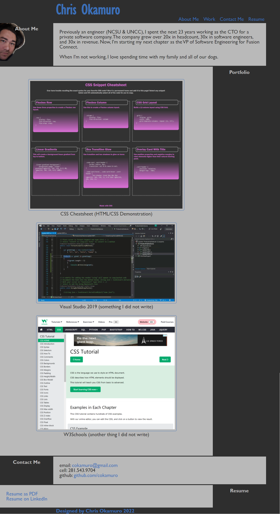
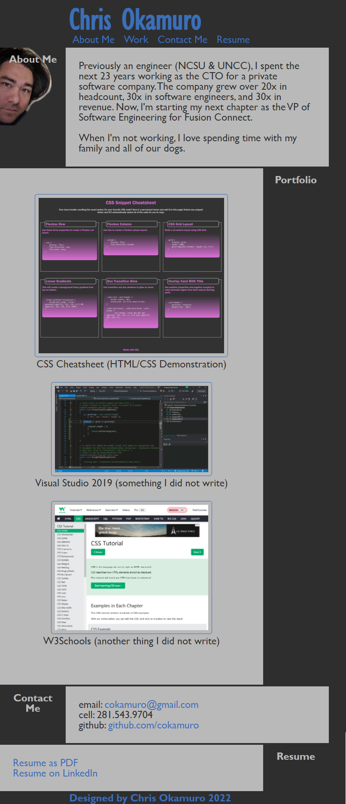

# Personal Portfolio PAge (02 Advanced CSS Challenge)

[Live Site on Github.io](https://cokamuro.github.io/portfolio/)

## Table of Contents
- [Description](#description)
- [Visuals](#visuals)
- [Usage](#usage)

## Description
This is the solution HTML and CSS for the 02-Challenge assignment in the 02-Advanced-CSS Module.

The purpose of the assignment was to create a portfolio of work to showcase my skills and talents to employers looking to hire.

This Portfolio page presents my name, a recent photo, navigation links, my work (and some stuff that's not my work), and contact information.  The nav links navigate within the document, while the portfolio links navigate to the various projects.  

## Visuals
### The site with normal width formatting

### The site with narrow width formatting

## Usage
This project is complete and should have no future revisions    
